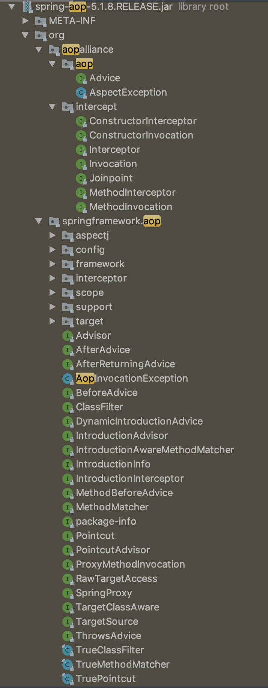

# 2019.11.05

오늘은 포비의 강의가 있었다. 포비가 다뤄주신 개념들과 좀 더 파고든 내용들을 살펴보려고 한다.

## 11월 5일 오늘의 명언

> 명언을 별로 좋아하진 않지만 그냥 TIL 만 쓰면 멋이 없을 것 같아서 쓰기 시작함

이미 끝나버린 일을 후회하기 보다는 하고 싶었던 일들을 하지 못한 것을 후회하라 - 탈무드

## 11월 5일 오늘의 할 일

- [x] 피드백 반영 완료
- [x] 유튜브 "우테코 지원 마감, 자소서 쓰시느라 고생 많으셨습니다."
- [x] TIL 작성

## Today I Learned

### 1. 피드백 반영하면서 다음 링크가 있는 답변을 받았다. 어떤 의도인지 분석하기 위해 TIL 에 추가한다.
> 본문 [stackoverflow](https://stackoverflow.com/questions/8550124/what-is-the-difference-between-dao-and-repository-patterns/15513290)

번역

#### Q. DAO 와 Repository 패턴의 차이점은 무엇인가요?

Data Access Object 와 Repository 패턴의 차이점은 무엇인가요? 저는 지금 EJB3, infra 단에서 Hibernate ORM, 설계 기술로 Domain-Driven Design 와 Test-Driven Development 를 사용하여 어플리케이션을 개발하고 있습니다.

#### A. DAO 는 data persistence 의 추상화이고, Repository 는 Object 들의 Collection 의 추상화이다.
> DAO 는 종종 테이블 중심적(table-centric), 데이터베이스와 밀접한 것으로 여겨지고,
DDD start 책에서 본 Layer 구분에서 DAO는 Infrastructure Layer 에 속해 있는 로직들을 말하는 것으로 해석할 수 있을 것 같다.

> Repository 는 Aggregate Root 들만 다루기 위해 Domain 과 밀접한 것으로 여겨진다.
DDD start 책에서 본 Layer 구분에서 Repository 는 Domain Layer 에 속해 있는 로직들을 말하는 것으로 해석할 수 있을 것 같다.

실제로는 DAO 는 Layer 개념 선에서 고민해보지 않았지만, Repository 는 도메인 로직이라고 알고 있고, DDD Start 에서 역시 Domain Layer 로 분류하며 도메인과 밀접한 로직을 갖기 때문에 테코브러리 스프링 프로젝트에서도 도메인과 한 패키지에 담아 관리한다.

> DAO를 이용하여 Repository 를 구현할 수 있지만, 반대는 안된다. (Repository 를 이용하여 DAO 를 구현하는 것은 안된다.)
``// 원글 : Repository could be implemented using DAO's, but you wouldn't do the opposite.``

내가 학습한 부분과 일치하는 것 같다. Repository 는 당연히 DB에서 받아온(Infrastructure Layer를 통해 받아와야 함) 값들을 이용해 도메인 객체를 생성하고 도메인 로직을 구현하지만, Repository 를 이용하여 DAO 를 구현하는 것은 논리적으로 맞지 않다. (내가 오역을 했을 가능성이 있기 때문에 code block 으로 원문을 붙여두었다.) 

> 또한, 레포지토리는 일반적으로 좁은(?) 인터페이스이다. 레포지토리는 Get(id), Find(ISpecification), Add(Entity) 메서드가 있는 단순한 객체 컬렉션이어야 한다.

이 부분은 와닿지가 않는다. **좁은 인터페이스(narrow interface)** 라는 말이 도메인 로직을 수행하는 데에서만 사용해야 되기 때문인지, 객체가 필드나 상태를 가지지 않기 때문에 좁다고 하는 것인지 잘 모르겠다. 아니면 둘 다인가?

> Update 같은 메서드는 DAO 에 적합하지만 Repository 에는 적합하지 않다. - Repository 를 사용하는 경우, Entities에 대한 변경 내용은 일반적으로 별도의 UnitOfWork에 의해 추적된다.

위의 맥락으로 보면 당연하다고 생각한다. DAO 는 Infrastructure Layer 에서 DB 와 직접적으로 연결 관계를 가지고 있고, Repository 는 Domain Layer 에서 비즈니스 로직을 처리하기 때문에 DB 의 값을 업데이트 하는 update 같이 *이미 존재하는 DB 의 값을 갱신하는 경우에는 Domain Layer 의 로직에서 Entity 객체의 상태를 변경해주고 Transaction 이 종료되는 시점에 Infrastructure Layer 에서 update 를 수행하는 것*이 내가 알고 있는 선에서는 맞는 것 같다. (issue #1, Hibernate 를 통해 확인하기)

> DAO에 더 가까워보이는 Repository 라고 불리는 구현체들을 보는 것이 더 일반적으로 보인다. 그렇기 때문에 이 두 개념의 차이점에 대해 몇몇 혼란이 있을 것이라고 생각한다.

혼란이 있어 피드백을 받은 것 같다.

### 2. Spring 의 3축 탐구

금일 포비의 강의를 들으며 추가 학습을 하려고 TIL 에 추가하였다. 스프링은 크게 3가지를 유저 대신 편리하게 처리 해주는 것으로 알고 있다. 원래는 DI, IoC, AOP 인 줄 알았는데 DI 가 IoC 에 속해 있는 개념이고 추가적으로 PSA(Portable Service Abstraction) 이 있다. 오늘 수업 때 배운 AOP 부터, IoC, PSA 를 차례대로 살펴보고자 한다.

#### AOP

Aspect Oriented Programming (관점 지향 프로그래밍)
* cf) Object Oriented Programming, Functional Programming
1. OOP 는 비즈니스 단의 로직 관심이 있는 프로그래밍 개념이라면 AOP 는 비즈니스 단의 로직이 아닌 인프라 단의 로직에 관심이 있다.

2. OOP 는 비즈니스 로직의 중복을 제거하는 것에 관심이 있는 반면 AOP 는 인프라 로직의 중복을 제거하는 것에 관심이 있다.
    * 인프라 로직이라 함은 권한 로직, DB 트랜잭션 로직, 데이터 캐싱, 로깅, 성능 측정과 같은 로직이 있다.
    * 현재 테코브러리의 jwt 인증 로직 및 권한 로직이 controller 의 method 에서 if 문으로 처리하고 있는데, Interceptor 로 빼려고 고민하고 있었지만, 안돌님과 무교수님, 쉨반님과의 대화를 통해 ServletFilter 에서 Dispatcher Servlet 을 통과하기 전에 validation 처리를 하고 valid 한 jwt 의 요청들만 container 로직으로 넘겨주면 어플리케이션의 부담을 줄여줄 수 있을 것 같다고 생각했는데 실제로 Spring Security 가 그렇게 처리한다고 한다.

3. 역시 뜯어보는 것이 진리다.

다음은 org.springframework:spring-aop:5.1.8RELEASE 의 패키지를 다 열진 못하지만 대충 이런 구조다. 쉣이다. 이걸 autumn-framework 로 전부 클로닝 할 생각하니 막막하지만 암튼 본다.

* 대충 강의 때 들었던 개념들이 보인다. Advice(ControllerAdvice), Interceptor, aspectj 등등.
* ControllerAdvice 는 어떤 Exception 이 발생했을 때 로직이 ExceptionHandler 어노테이션이 붙어있는 메서드로 순간 이동한다. 그럼 여기서 Exception Handling Logic 을 실행하고 응답까지 할 수 있다.
* 그럼 ControllerAdvice 에서 AOP 의 용어 target, advice, pointcut, joinpoint 를 적용해 보면
    * target 은 ExceptionHandler 어노테이션에 ``[]`` 로 지정한 Exception 들이 부가 기능을 부여할 대상이라고 볼 수 있을 것 같다.
    * advice 는 역시 이름에서도 들어나듯 ControllerAdvice 가 target 에 제공할 부가 기능을 담은 클래스라고 할 수 있겠다.
    * pointcut 은 advice 가 적용될 target 을 지정하는 것을 의미한다고 하는데 이 target 의 지정은 ExceptionHandler 어노테이션으로 한다. 아마 ExceptionHandler 어노테이션이 pointcut 인 것 같다.
    * joinpoint 를 모르겠다. 이건 진짜 모르겠다. 아마 추측컨데 Controller 단에서 Exception 이 발생하는 로직이 들어 있는 Controller 의 method 가 아닐까 싶다.
* 근데 이상하다. ExceptionHandler 어노테이션 밖에 없는 시시한 프레임워크가 아닐꺼라 믿어서 찾아보니 ``@InitBinder``, ``@ModelAttribute`` 가 추가적으로 있다. [링크](https://docs.spring.io/spring-framework/docs/current/javadoc-api/org/springframework/web/bind/annotation/ControllerAdvice.html) (issue #2, Spring AOP InitBinder, ModelAttribute)
* 이건 블로그가 아니니까 이만한다. 충분히 뭐 공부했는지 복습 가능했다.

#### IoC

Inversion of Control, 제어의 역전이다. 이건 레벨2 에서 노션에 따로 정리를 한 적이 있어서 기억난다. 간단히 하고 넘긴다. 의존성을 주입하는 데 있어서 저수준 모듈에서 고수준 모듈에 직접 주입하는 것이 아니라 저수준 모듈의 클래스를 고수준 모듈에 추상화 시키고 추상화 된 고수준 모듈의 클래스를 주입 target 에 주입한다는 것이 이것의 요이다.

#### PSA (Portable Service Abstraction)

처음봤다. 이런걸 해주는지도 몰랐다. 강의 중 들은 내용에 의하면 Service 구체 클래스의 추상화를 Spring 이 몰래 해주기 때문에 느끼지 못한 것 같다. 이것 역시 issue 로 등록해서 추가 학습으로 언젠간 TIL 에 올린다. (issue #3, PSA 가 무엇인가, 동작과정까지 탐구하기, 어떻게 추상화를 하여 어떤 부산물이 발생하고 어디에 어느 시점에 나오는지 탐구한다)

### 3. Event-Driven 과 Thread-Driven 에 대한 고찰과 안돌의 답변

역시 안돌은 모르는 게 없다. 요즘에 내가 궁금해진 부분은 Event-Driven Node 의 내부구조, Thread-Driven Spring 의 내부구조, 프록시 서버로 많이 사용되는 Nginx 의 Event-Driven 방식과 장단점 및 각 지점에서의 처리 방식이다. 그냥 지하철 왔다갔다하면서 그림만 그리고 있는데 오늘 안돌과의 대화에서 많은 부분들을 해결할 수 있었다.

근데 또 이것도 말이 길어질 것 같다. 근데 마침내 어느 정도 큰 그림이 잡혔고 이걸 글로 막 써내려 나가면 나중에 누군가 봤을 때 수정해 줄 수도 있고 면접에서 어떤 말을 할 수 있을지 정리될 것 같아서 일단 정돈하지 않고 막 쓴다.

먼저 Nginx 와 Apache 이다. 이전에 CU로부터 Nginx 와 Apache 에 대한 키워드들(Prefork 방식, Worker 방식, Event Driven 방식) 을 얼핏 들은 적이 있는데 별로 와닿지가 않아서 우선순위에서 계속 밀린 적이 있다. 아마 레벨1 이었던 것 같다. 암튼 각설하고 Apache 의 두 방식인 Prefork, Worker 에 대하여 살펴보면

Apache 는 MPM (Multi Process Module), Nginx 는 앞단의 Single Thread 를 통해 요청을 받아 Event Loop, Service-Worker(Multi-Thread) 로 처리하여 응답을 해준다. *근데 Nginx 의 치명적인 단점이 있다. 더더더더 아래서 쓰겠지.*

#### Apache Prefork
아파치는 MPM 이라는 말에서 드러나듯, Multi Process 다. 그 중에서도 Prefork 방식은 Parent Process 를 fork (신기하게도 github 의 fork 와 비슷하다. 그냥 새로 단어 못 만들어서 돌려쓰는 경우가 많아 보인다.) 해서 처리한다. 그런데 이 방식은 그냥 프로세스만 복제한다. (메모리까지 ! it is an un-oriented model thread. This means that each child Apache process includes a single thread and handles one request at a time. 어떤 외국인의 글에 의하면 각 아파치 child process 는 싱글 스레드를 가지고 있고 한번에 하나의 요청만 처리할 수 있다. 매우 구려보인다. 멋도 없고) connection 이 계속 물려있거나 요청에 대한 처리 시간이 오래 걸리면 다른 요청이 들어올 수 없다. 당연히 싱글 쓰레드니까

#### Apache Worker
역시 MPM 이다. 이 역시 *프로세스 forking 이 발생하는 것 같다*. 근데 child 프로세스들이 여러 개의 thread 를 가진다. 프로세스 당 64개의 thread 를 가질 수 있고 이 말은 Prefork 방식과 다르게 connection 이 하나 물려 있어도 다른 요청이 들어올 수 있다. 당연히 Thread 가 여러개니까 하지만, 정말 엄청난 수의 요청이 들어오고 그 요청 하나 하나 시간이 오래 걸려서 fork 된 프로세스의 thread 들을 모두 점유하게 된다면 다른 요청이 들어올 수 없다. 그 전에 죽어버리지 않을까 싶다.

#### Nginx Event Driven
진짜 멋진 방식인 것 같다. 요청은 Single Thread 로 Queue 에 받는다(문서에 따르면 max_conns 에서 튜닝할 수 있는 것 같은데 Nginx Plus 만 가능하다고 하는 것 같다.). 이 요청을 받아 놓는 공간이 비어있을 때, Event Loop 가 돌면서 Worker Thread Pool 에서 완료된 Task 를 가지고 다시 옮김으로써 요청에 대한 응답을 처리해줄 수 있다. nginx 의 configuration 파일을 최초로 열어보면 ``event { worker_connections  1024; }`` 가 있는데 이게 아마 Worker Thread 의 default 수 인 것 같다. 이 Worker Thread 가 가득차고 요청을 받아놓는 queue 가 차있으면 최악의 경우 응답을 내보내지 못할 가능성이 생길 수 있는 것으로 보인다.

그러면 갑자기 생각난건데 요청을 받는 큐와 응답을 해주는 큐를 별도로 두는 event handling 로직을 구성하면 어떨까 시간날 때 생각나면 그냥 내가 해봐야겠다. 나는 개발자니까 후훗

## 스스로 피드백

* 다 작성하고 나니 한 시간이 넘었다. 더 줄이도록 해야겠다.
* 이게 내가 블로그가 안 맞는 이유와 일맥 상통한다. 하나 찾아보다가 모르는게 있으면 그거 때문에 Queue 에 계속 쌓이고 이걸 처리하는 Worker Thread 도 하나여서 마무리를 못한다. 지식 탐구에서 상한선을 두는게 맞는 것인가. 고민할 필요가 있어보인다.

## 참고

* 가선생님의 블로그에서
    - [Apache MPM 및 Nginx](https://brainbackdoor.tistory.com/28)
    - [blocking vs non-blocking / synchronous vs asynchronous](https://brainbackdoor.tistory.com/26)

* 외국 어딘가에서
    - [Apache Multiprocessing Modules (MPMs)](https://www.eukhost.com/kb/apache-multiprocessing-modules-mpms/)