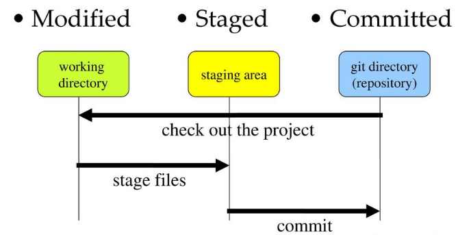

# 2019.11.06

오늘은 면접 시간을 알려주는 메일이 왔다. 사실 별로 떨리진 않지만 너무 가고 싶은 회사라 좋은 결과 있으면 좋겠다. 별 다른 준비 없이 가서 내가 6개월 동안 교육 받고 그 내용들을 도서 관리 서비스 운영하면서 작은 현장에 적용해 본 경험을 다 털어 놓으면 될 것 같다. 사실 도서 관리 서비스 말하면 6시간 동안 강의도 할 수 있을 것 같다.

## 11월 6일 오늘의 명언

우리의 선한 의지가 지구를 모두 덮을 때까지 - 비바리퍼블리카 이승건 대표

## Today I Learned

### git 의 기본 동작 원리

git 은 단순하게 커밋만 쌓이는 것이 아니라고 한다. 역시 안보이는 부분들이 있었다. 

git 은 index, repository, working directory 세 부분을 통해 버전 관리를 한다. 또한 각각의 부분은 Staged 상태, Committed 상태, Modified 상태와 관련이 있다.

근데 이건 git status 를 치면 바로 확인할 수 있다. modified, staged 두 분으로 나뉘어 git status 가 알려준다.

#### Repository

그냥 이건 뭐 로컬 레포지토리와 리모트 레포지토리가 있다. 레포지토리는 커밋을 관리한다. committed 는 이것이 관리한다.

#### Working Directory

``/.git`` 을 제외한 해당 directory 의 영역을 말한다. modified 상태에 대하여 관리한다.

#### Index (Staging Area)

commit 을 작성하기 전 ``git add .`` 를 통해 파일들을 staged 상태로 두는 것을 말한다. index 가 stage 상태를 관리한다.

## 스스로 피드백

* 지난 몇 일간 너무 피곤해서 오늘은 간단하게 새로 안 git 의 내용에 대하여 돌아보았다. (안선생님 @andole87 에게 요즘 너무 감사하다. 사실은 김선생님이네...)
* 오늘은 크루들에게 CORS 만 열번 설명한 것 같다.
* 내일은 내가 필요한 면접 포인트들을 정리하는 시간을 가져야겠다.

## 참고
* [Git 3가지 상태 정리](https://medium.com/sjk5766/git-3%EA%B0%80%EC%A7%80-%EC%83%81%ED%83%9C%EC%99%80-%EA%B0%84%EB%8B%A8-%EB%AA%85%EB%A0%B9%EC%96%B4-%EC%A0%95%EB%A6%AC-a80161aacec1)