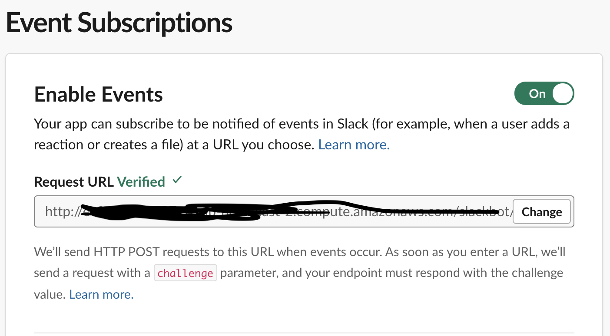
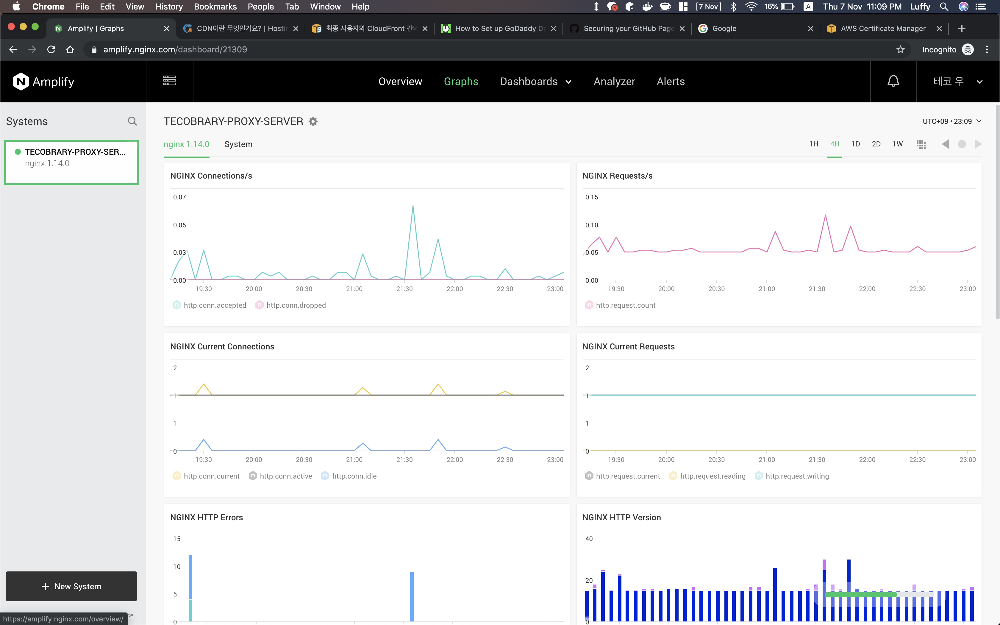

# 2019.11.07

내일은 면접이다. 마인드 컨트롤을 잘 하자.

## 11월 7일 오늘의 명언

절대 어제를 후회하지 마라. 인생은 오늘의 나 안에 있고, 내일은 스스로 만드는 것이다. - L론 허바드

> 나는 내일을 만들러 간다.
> 내일 면접으로 좋은 결과를 얻지 못해도 나는 어차피 개발자 될 것이고,
> 더 좋은 개발자가 되어 날 알아보지 못한 사람들이 후회하도록 하면 된다. 

## Today I Learned

오늘은 딱히 뭐 주제를 정해놓고 한다기 보단 오늘 했던 일들에 대해 돌아보도록 하려고 한다.

1. slack bot 기능 구현 - bot mention 시 정해진 메시지 보내는 기능
2. nginx monitoring 도구 추가 - amplify

### Slack Bot 새로운 기능

지금 테코브러리의 도메인은 매우 복잡한 cloudfront 가 제공하는 도메인을 사용하고 있다. 그래서 테코브러리를 이용하려고 할 때마다 나에게 와서 어디로 접속해야 하는지 물어보는 과정을 거친다.
슬랙 봇을 멘션하면 알려주는 기능이 있으면 좋을 것 같고 별로 고려할 사항이 없을 것 같기도 해서 오전에 기능을 구현하고 배포했다.
그런데 재미있는 점이 하나 있었다.
{: width="50%"}{: .center}

위의 Request URL 을 Http 로 해야된다는 것이다. 요즘에 http 를 request url 로 지정하는 신기한 일이 학교 홈페이지도 아니고 슬랙이라는 서비스에 있다는 것이 신기했다.

그래서 처음엔 https 로 통신하도록 세팅해둔 cloudfront 로 nginx 에 매핑해 둔 slack bot 어플리케이션의 controller 메서드로 요청을 보내도록 했는데, 아예 로그에 찍히지도 않는다.

### nginx monitoring 도구 추가 !

전체 서비스의 모든 요청을 앞단에서 받고 있는 nginx 에 모니터링 도구인 amplify 를 추가하였다 !

멋있다 ! 이걸로 무엇을 할 수 있을지는 차차 알아보려고 한다.

오늘 슬랙 봇 메시지 보내는 기능을 추가하면서 인스턴스 내부의 요청만 처리하던 slack bot container 가 nginx 에도 매핑이 추가되었다.

## 스스로 피드백

* 빨리 면접 걱정 안하고 공부하고 싶다...
* 오늘은 뭐가 안잡혀서 평소에 필요한 기능을 배포했다. 도커가 참 편하다.
* flask best practice 를 찾아봐야겠다. 패키지 관리를 어떻게 해야할까.
